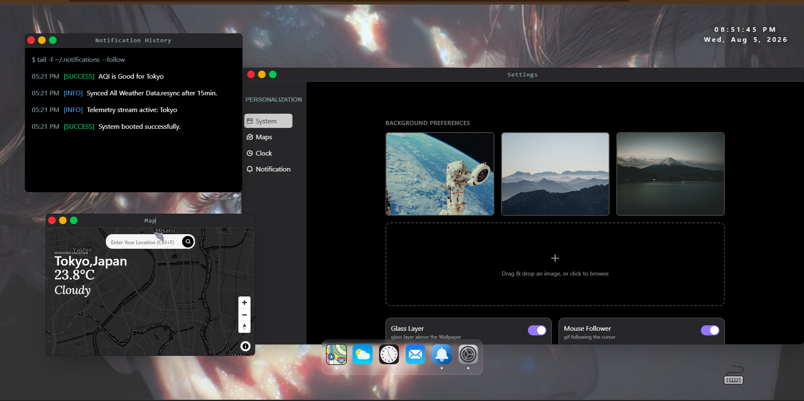
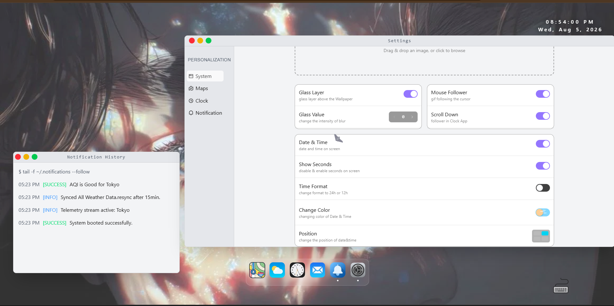
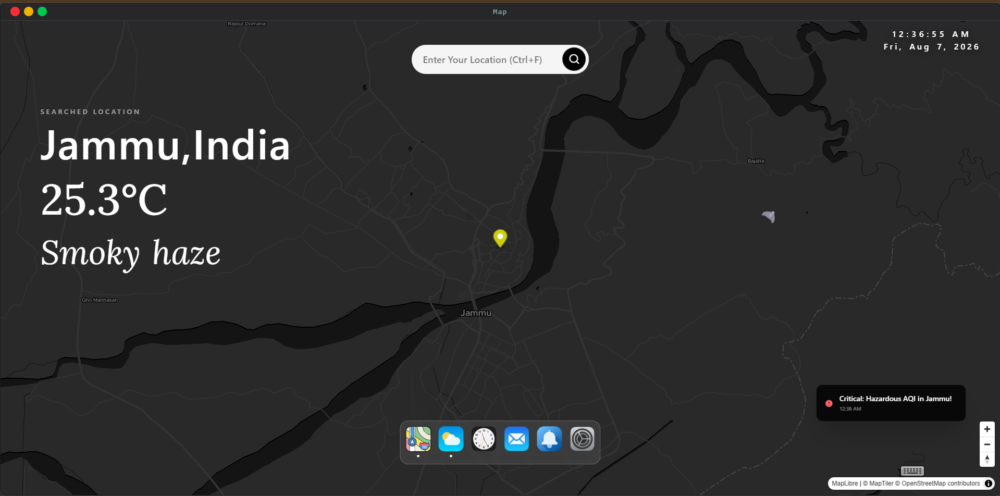
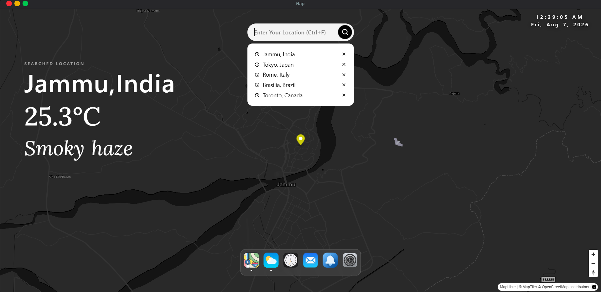
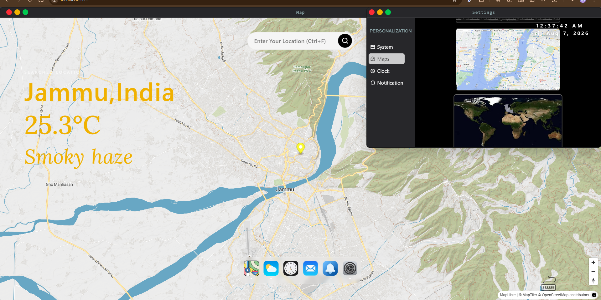
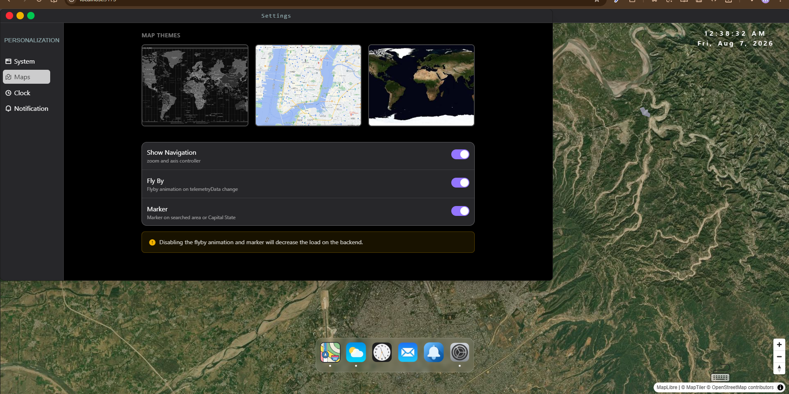
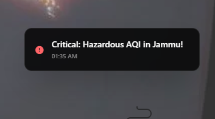
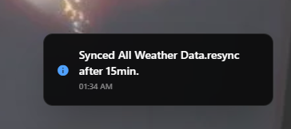
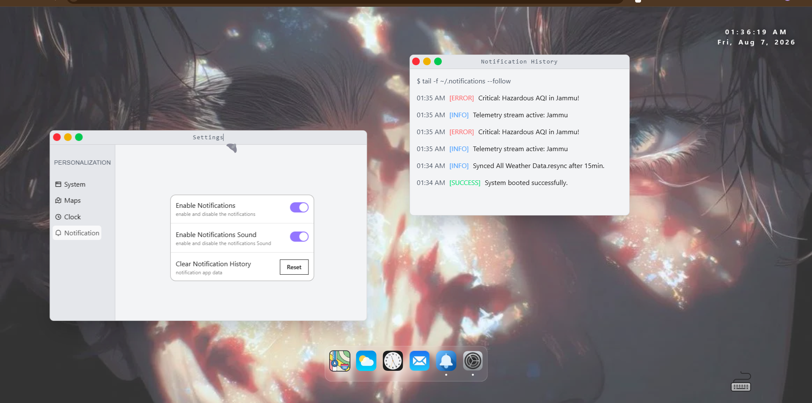

# 🌤️ Weather OS 

**A highly interactive, deeply customizable weather dashboard built within a simulated desktop environment.** 

Weather OS isn't just a weather app; it's a front-end engineering showcase. By treating the browser window like a native operating system, this project demonstrates advanced state management, complex DOM manipulation, and responsive window handling. 

 


## 💻 Tech Stack
This project utilizes a modern, performance-focused frontend stack:
* **Core:** React 19, TypeScript, Vite
* **Styling & Animation:** Tailwind CSS, SCSS, GSAP, Lenis (Smooth Scrolling)
* **State Management:** Zustand, React Query
* **Testing & Reliability:** Cypress, Jest, Sentry
* **Mapping:** MapLibre GL, React-Map-GL
## 📦 Core Dependencies
The system relies on the following major packages to power its OS simulation and data visualization:

```json
"dependencies": {
  "@gsap/react": "^2.1.2",
  "@tailwindcss/vite": "^4.3.1",
  "@tanstack/react-query": "^5.101.0",
  "axios": "^1.17.0",
  "gsap": "^3.15.0",
  "lenis": "^1.3.25",
  "maplibre-gl": "^5.24.0",
  "react": "^19.2.6",
  "react-dom": "^19.2.6",
  "react-error-boundary": "^6.1.2",
  "react-loading-skeleton": "^3.5.0",
  "react-map-gl": "^8.1.1",
  "react-rnd": "^10.5.3",
  "remixicon": "^4.9.1",
  "sass": "^1.101.0",
  "styled-components": "^6.4.3",
  "tailwindcss": "^4.3.1",
  "zustand": "^5.0.14"
}
```

## 🛠️ The OS Experience

The core philosophy of Weather OS is to provide a fluid, desktop-like experience entirely within the browser. 

### Universal Window Architecture & macOS Controls
Every application within the OS is wrapped in a custom, highly fluid parent container that mimics native desktop behavior:




* **Mac-Style Window Controls:** Each window features fully functional traffic-light buttons (close, minimize, maximize) identical to macOS, controlled via global state.
* **Fluid Resizing & Responsiveness:** Windows can be freely resized and draggable by the user. Because the internal apps are built using modern CSS Container Queries instead of standard media queries, the internal UI perfectly adapts to the *window's* specific dimensions, regardless of the user's actual monitor size.

### Advanced Navigation & Command Controls
To maximize accessibility and speed, the OS features multiple ways to interact with the environment:
* **Dynamic App Launching:** Apps are launched via a centralized macOS-style Dock. Clicking an app icon mounts its respective window and dynamically updates its Z-index to bring it to the forefront.
Clicking on any of App increase their Zindex and bring them to forefront.
* **Right-Click Context Menus:** A custom right-click event listener provides native-feeling dropdowns to quickly manage or close active windows without needing to reach for the close button.
* **Keyword Command System:** Power users can utilize a built-in terminal/command feature to execute text-based actions. Users can type commands to open apps, close specific windows, execute a "kill all" command to wipe the workspace, and instantly toggle the terminal's theme between Light (White) and Dark (Black) modes.

### Deep Customization & Personalization
The operating system environment is highly malleable, giving users complete control over their workspace aesthetics through a dedicated Settings application.

* **Context-Aware Mouse Follower:** A custom-built, animated cursor follower powered by GSAP that dynamically adapts to the current state of the OS:
    * **Day/Night Cycle Sync:** The follower reads the live API data of the currently selected city. If it is daytime in that region, a stylized sun trails the cursor; if it is nighttime, it transforms into an animated bat.
    * **App-Specific Reactions:** The follower's behavior and shape are globally state-aware, morphing or reacting depending on which specific app or window the user is interacting with.
* **Wallpaper Engine:** Users can select from a curated list of default wallpapers or upload their own custom backgrounds (supporting images up to 2MB).
* **Desktop Clock Configuration:** The global desktop date and time display is fully modular:
    * **Format Toggles:** Switch between 12-hour and 24-hour time formats, and toggle the display of seconds.
    * **Aesthetic Controls:** Adjust the text color to contrast perfectly with custom wallpapers.
    * **Spatial Positioning:** A custom grid-based positioning tool allows the user to snap the clock to different corners of the screen.


## 🗺️ Map Engine

The Map application acts as the central nervous system of this OS. Powered by **MapTiler**, it is a fully interactive, responsive, and highly customizable mapping experience that drives the location state for the rest of the ecosystem.


### ✨ Core Features

*   **The Global Search Bar (The Heart):** Triggered via `Ctrl+F`, this search engine dictates the data flow of the entire OS. Search for any location globally to add it to your roster, switch between saved cities instantly, or clean up your list by deleting them directly from the dropdown menu.
*   **Fluid Interactivity:** A fully draggable map canvas with seamless zoom in/out capabilities. The layout is strictly responsive, adapting perfectly to different window states.
*   **Cinematic Animations:** Features smooth, automated "Fly-By" camera animations that physically pan across the globe when a new city is selected. The typography and weather data overlays also feature clean entrance animations on state changes.

---


### ⚙️ Theming & Customization

The map is deeply integrated with the native **Settings App**, allowing users to customize their visual preferences and performance footprint on the fly:

**🎨 3 Distinct Map Themes:**
*   **Dark:** A sleek, high-contrast tactical view.
*   **Light:** A standard, highly readable street view.
*   **Satellite:** High-resolution global topography.

**⚡ Performance Toggles:**
*   **Show Navigation:** Toggle the on-screen zoom and axis controllers.
*   **Fly-By:** Enable or disable the cinematic panning animations.
*   **Markers:** Toggle the physical pin on searched areas.

> **⚠️ Note:** Disabling the fly-by animation and markers can decrease the load on the backend for lower-end hardware.



7
## 🔔 Global Notification System

A custom-built, OS-level notification service that keeps users informed of system states, API rate limits, and network status without disrupting the core user experience.

### ✨ Core Features

*   **Dynamic Alert States:** Fully typed and styled toast notifications handling three distinct alert levels: **Info**, **Warning**, and **Error**. 
*   **Immersive UX:** Every notification features smooth, physics-based entrance and exit animations, accompanied by non-intrusive audio cues.
*   **Dedicated Notification App:** Missed a pop-up? The OS includes a dedicated Notification Center application that logs your complete alert history along with precise timestamps.

---

### ⚙️ User Controls & Settings

The notification architecture is deeply wired into the global Settings App, giving users complete control over their alert environment:

*   **Do Not Disturb (DND):** Globally toggle all on-screen notification pop-ups on or off.
*   **Audio Toggles:** Enable or mute system notification sounds.
*   **History Management:** A one-click "Clear History" function within the app to flush the local notification log and free up state memory.