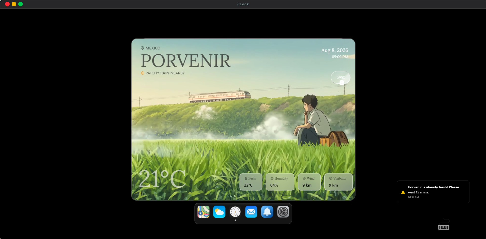

# 🌤️ Weather OS 

**A highly interactive, deeply customizable weather dashboard built within a simulated desktop environment.** 

Weather OS isn't just a weather app; it's a front-end engineering showcase. By treating the browser window like a native operating system, this project demonstrates advanced state management, complex DOM manipulation, and responsive window handling. 

 

# 🌤️ Weather-OS

A robust, web-based operating system dashboard featuring real-time weather synchronization, physics-based window management, and interactive spatial mapping. Built with a strict emphasis on production-grade state management, cache deduplication, and fault tolerance.

## 🚀 Key Features

* **Advanced Window Management:** Fully draggable, resizable, and stackable application windows with dynamic z-index calculation.
* **Silent Background Sync:** Automated 15-minute weather data polling with strict cache invalidation and race-condition mitigation to prevent UI blocking or infinite render loops.
* **Hardware-Accelerated Motion:** Physics-based drag mechanics, fluid scroll normalization, and complex sequence choreographies (SVG timelines, text splitting).
* **Isolated Fault Tolerance:** Component-level error boundaries ensuring that individual application crashes (e.g., WebGL map failures) do not take down the entire OS environment.
* **Production Observability:** Integrated error tracking and breadcrumb logging to monitor live application stability.

## 🛠️ Tech Stack & Architecture

### Core & Runtime
* **HTML5 & Modern Web APIs** – Semantic layout, DOM manipulation, ResizeObserver API, and Web Audio/Media contexts.
* **JavaScript (ESNext) & TypeScript (TSX)** – Strictly typed codebase, custom interfaces, generic store hooks, and build-time type safety.
* **React 18 / 19** – Concurrent mode, component lifecycles, lazy loading (`React.lazy`), and async boundary suspense (`Suspense`).
* **Vite** – Ultra-fast Next-Gen frontend build tooling, HMR, and environment-level configuration.

### State Management & Data Fetching
* **Zustand** – Lightweight global state orchestrator handling window management, z-index hierarchy, user telemetry, and background app configurations.
* **TanStack React Query v5** – Server-state management, cache deduplication, background sync scheduling, and custom cache invalidation pipelines.
* **TanStack Query Devtools** – Real-time inspection of active, stale, and garbage-collected network queries and mutation states.
* **Axios** – Promise-based HTTP client managing external Weather and Geocoding REST API contracts.

### Styling & Motion Engineering
* **SCSS / Sass** – Modular CSS architecture featuring native `@container` queries, CSS grid configurations, and responsive `clamp()` functions.
* **Tailwind CSS** – Utility-first dynamic styling, glassmorphism overlays, and layout constraints.
* **GSAP Core & @gsap/react (`useGSAP`)** – Hardware-accelerated UI choreographies and seamless React lifecycle integration for animation cleanup.
* **GSAP Draggable** – Physics-based, smooth drag-and-drop mechanics powering the OS window management and positioning system.
* **GSAP ScrollTrigger** – Scroll-linked animation timelines for precise, scroll-driven UI reveals.
* **GSAP SplitText** – Dynamic text splitting for complex, character-staggered entry animations.
* **@studio-freight/lenis** – Smooth scroll normalization engine across desktop viewports.
* **MapLibre GL & react-map-gl** – WebGL-based vector interactive mapping engine, camera flybys, coordinate markers, and spatial rendering.
* **React Loading Skeleton** – Contextual skeleton loaders for graceful asynchronous content delivery.

### Testing & Quality Assurance
* **Vitest** – High-performance native unit test runner with fake timer mocks and environment orchestration.
* **React Testing Library (@testing-library/react)** – Custom hook validation (`renderHook`), component integration tests, and user-event simulation.
* **React Error Boundary** – Isolated component crash fallback wrappers preventing global unmount cascading.

### Observability & Monitoring
* **Sentry (@sentry/react)** – Production real-time exception tracking, breadcrumb logging, and error boundary monitoring.

## 🧠 Architecture Highlights

**Defensive State Synchronization**
To prevent infinite render loops and redundant API calls during rapid component mounting, the sync engine utilizes dependency checks and timestamp-guards. Data is conditionally committed to the Zustand store only if a deep comparison confirms absolute delta changes, saving memory allocation and preventing cascade re-renders.

**Feature-Sliced Routing**
Heavy dependencies like MapLibre and GSAP logic are dynamically imported using React `lazy` and `Suspense`. Apps remain unmounted until explicitly invoked by the user, keeping the initial JavaScript bundle exceptionally lightweight.

## 📦 Getting Started

1. Clone the repository
2. Install dependencies: `npm install`
3. Configure environment variables (`.env.local`):
   * `VITE_WEATHER_API_KEY=`
   * `VITE_MAPTILER_KEY=`
   * `VITE_SENTRY_DSN=` (Optional for local development)
4. Start the development server: `npm run dev`
5. Run the test suite: `npm run test`

## 🛠️ The OS Experience

The core philosophy of Weather OS is to provide a fluid, desktop-like experience entirely within the browser. 

### Universal Window Architecture & macOS Controls
Every application within the OS is wrapped in a custom, highly fluid parent container that mimics native desktop behavior:

* **Mac-Style Window Controls:** Each window features fully functional traffic-light buttons (close, minimize, maximize) identical to macOS, controlled via global state.
* **Fluid Resizing & Responsiveness:** Windows can be freely resized and draggable by the user. Because the internal apps are built using modern CSS Container Queries instead of standard media queries, the internal UI perfectly adapts to the *window's* specific dimensions, regardless of the user's actual monitor size.

### Advanced Navigation & Command Controls
To maximize accessibility and speed, the OS features multiple ways to interact with the environment:
* **Dynamic App Launching:** Apps are launched via a centralized macOS-style Dock. Clicking an app icon mounts its respective window and dynamically updates its Z-index to bring it to the forefront.
Clicking on any of App increase their Zindex and bring them to forefront.
* **Right-Click Context Menus:** A custom right-click event listener provides native-feeling dropdowns to quickly manage or close active windows without needing to reach for the close button.
* **Keyword Command System:** Power users can utilize a built-in terminal/command feature to execute text-based actions. Users can type commands to open apps, close specific windows, execute a "kill all" command to wipe the workspace, and instantly toggle the terminal's theme between Light (White) and Dark (Black) modes.

### Deep Customization & Personalization
The operating system environment is highly malleable, giving users complete control over their workspace aesthetics through a dedicated Settings application.

* **Context-Aware Mouse Follower:** A custom-built, animated cursor follower powered by GSAP that dynamically adapts to the current state of the OS:
    * **Day/Night Cycle Sync:** The follower reads the live API data of the currently selected city. If it is daytime in that region, a stylized sun trails the cursor; if it is nighttime, it transforms into an animated bat.
    * **App-Specific Reactions:** The follower's behavior and shape are globally state-aware, morphing or reacting depending on which specific app or window the user is interacting with.
* **Wallpaper Engine:** Users can select from a curated list of default wallpapers or upload their own custom backgrounds (supporting images up to 2MB).
* **Desktop Clock Configuration:** The global desktop date and time display is fully modular:
    * **Format Toggles:** Switch between 12-hour and 24-hour time formats, and toggle the display of seconds.
    * **Aesthetic Controls:** Adjust the text color to contrast perfectly with custom wallpapers.
    * **Spatial Positioning:** A custom grid-based positioning tool allows the user to snap the clock to different corners of the screen.

## 🗺️ Map Engine

The Map application acts as the central nervous system of this OS. Powered by **MapTiler**, it is a fully interactive, responsive, and highly customizable mapping experience that drives the location state for the rest of the ecosystem.

### ✨ Core Features

*   **The Global Search Bar (The Heart):** Triggered via `Ctrl+F`, this search engine dictates the data flow of the entire OS. Search for any location globally to add it to your roster, switch between saved cities instantly, or clean up your list by deleting them directly from the dropdown menu.
*   **Fluid Interactivity:** A fully draggable map canvas with seamless zoom in/out capabilities. The layout is strictly responsive, adapting perfectly to different window states.
*   **Cinematic Animations:** Features smooth, automated "Fly-By" camera animations that physically pan across the globe when a new city is selected. The typography and weather data overlays also feature clean entrance animations on state changes.

---

### ⚙️ Theming & Customization

The map is deeply integrated with the native **Settings App**, allowing users to customize their visual preferences and performance footprint on the fly:

**🎨 3 Distinct Map Themes:**
*   **Dark:** A sleek, high-contrast tactical view.
*   **Light:** A standard, highly readable street view.
*   **Satellite:** High-resolution global topography.

**⚡ Performance Toggles:**
*   **Show Navigation:** Toggle the on-screen zoom and axis controllers.
*   **Fly-By:** Enable or disable the cinematic panning animations.
*   **Markers:** Toggle the physical pin on searched areas.

> **⚠️ Note:** Disabling the fly-by animation and markers can decrease the load on the backend for lower-end hardware.

7
## 🔔 Global Notification System

A custom-built, OS-level notification service that keeps users informed of system states, API rate limits, and network status without disrupting the core user experience.

### ✨ Core Features

*   **Dynamic Alert States:** Fully typed and styled toast notifications handling three distinct alert levels: **Info**, **Warning**, and **Error**. 
*   **Immersive UX:** Every notification features smooth, physics-based entrance and exit animations, accompanied by non-intrusive audio cues.
*   **Dedicated Notification App:** Missed a pop-up? The OS includes a dedicated Notification Center application that logs your complete alert history along with precise timestamps.

---

### ⚙️ User Controls & Settings

The notification architecture is deeply wired into the global Settings App, giving users complete control over their alert environment:

*   **Do Not Disturb (DND):** Globally toggle all on-screen notification pop-ups on or off.
*   **Audio Toggles:** Enable or mute system notification sounds.
*   **History Management:** A one-click "Clear History" function within the app to flush the local notification log and free up state memory.

### 🔄 Weather Data Flow & Cache Architecture

The Weather OS relies on a dual-hook system to manage API calls, cache state, and UI synchronization. We use **Zustand** as the global state source of truth and **TanStack React Query** for fetching, caching, and background synchronization. 

Here is how `useSearchLocation` and `useSyncAllWeather` work together to create a seamless, non-blocking data loop:

#### 1️⃣ `useSearchLocation` (The Initiator & Cache Seeder)
This hook handles manual user searches. When a user types in a city, this mutation fires off. 
* **What it does:** It fetches the live weather and AQI data for the requested city.
* **The Cache Trick:** Instead of a standard `axios.get` inside the mutation, it executes a `queryClient.fetchQuery` using the specific key `["syncWeather", locationName]`. This intentionally injects the fresh API response directly into React Query's cache *before* doing anything else.
* **The Handshake:** On success, it takes that data and pushes it into Zustand's global `searchHistory` state via `addSearchToHistory`. It also reads the AQI and triggers the appropriate OS toast notifications.

#### 2️⃣ `useSyncAllWeather` (The Background Engine)
This hook acts as a background daemon that keeps the entire OS up to date without the user needing to refresh.
* **What it does:** It listens to Zustand's `searchHistory` array. For every city stored in history, it dynamically generates a query inside a `useQueries` hook. 
* **The Gatekeeper (Preventing Loops):** Since `useQueries` will return data every time it runs (even from cache), it triggers a `useEffect`. To prevent an infinite render loop (React Query updates Zustand ➡️ Zustand re-renders Hook ➡️ React Query updates Zustand again), we do a strict stringified comparison (`JSON.stringify(oldCityData) !== JSON.stringify(newCityData)`). Zustand is *only* updated if the actual weather values (temp, wind, etc.) have changed.

#### 🤝 The Cache Connection (Why they share a `queryKey`)
The real magic is how these two hooks share the exact same query key pattern: `["syncWeather", locationName]`.

1. When a user searches a new city, `useSearchLocation` fetches the data and assigns it a 15-minute `staleTime`.
2. It pushes the city to Zustand's `searchHistory`.
3. `useSyncAllWeather` immediately detects the new city in `searchHistory` and creates a new background query for it.
4. **The Optimization:** Because `useSyncAllWeather` looks for the exact same `["syncWeather", locationName]` key, it sees that `useSearchLocation` *just* put fresh data in the cache seconds ago. 
5. Instead of making a duplicate API call, it instantly consumes the cached data. It will then quietly sit in the background and wait 15 minutes (`refetchInterval`) before actually hitting the Weather API again.

> **💡 The Result:** This architecture ensures **zero duplicate API calls**, **instant UI updates**, and **silent background data syncing**.

### 🕒 The Clock App (World Time & Weather Dashboard)

The Clock application acts as the visual frontend for the caching architecture, translating the raw API data from `searchHistory` into a cinematic, highly interactive UI.

* **Dynamic State Rendering:** The app listens directly to Zustand's `searchHistory` array. Every time a new city is queried, the app automatically generates and mounts a new visual card for that location, consuming the real-time data from the React Query cache.
* **GSAP Stack Physics:** To avoid a standard, static list, the UI employs **GSAP (GreenSock)** to manage complex stacking animations. Cards elegantly fan out, stack, and transition with smooth physics as you interact with multiple saved locations.
* **Smart Sync Engine:** Every card features a dedicated **Sync** button that interacts directly with our cache layer:
  * **Hover State:** Reads the React Query cache and displays exactly how much time is left before the background daemon automatically refreshes that city's data.
  * **Active Click:** Bypasses the 15-minute `staleTime` cache lock, forcing an immediate, localized API fetch to update that specific card instantly.
* **Cinematic Media Toggle:** To push the visual architecture further, card backgrounds are fully dynamic. They adapt to the current weather condition of the city, and through the global OS Settings, users can upgrade the static image backgrounds to immersive, auto-playing video loops.